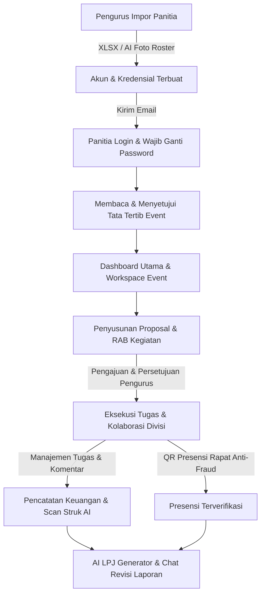

# Ringkasan Proyek: Sistem Kepanitiaan HMIF UKRI

Dokumen ini disusun sebagai panduan menyeluruh mengenai **Sistem Kepanitiaan HMIF UKRI**, mencakup latar belakang masalah, solusi, alur kerja pengguna (*user flow*), dan daftar fitur lengkap untuk membantu persiapan presentasi dan demo di hadapan juri.

---

## 1. Masalah & Solusi (Problem Solving)

*   **Masalah:**  
    Koordinasi kepanitiaan mahasiswa seringkali berantakan dan terfragmentasi. Tugas-tugas divisi tidak terpantau (hanya lewat WhatsApp), berkas administrasi berserakan di Google Drive yang tidak teratur, pencatatan keuangan/RAB rawan selisih, presensi rapat mudah dipalsukan (titip absen), dan pembuatan Laporan Pertanggungjawaban (LPJ) akhir selalu tertunda lama karena panitia kehilangan riwayat data kegiatan.
*   **Solusi:**  
    Sebuah platform kolaborasi *all-in-one* internal panitia yang mengintegrasikan manajemen tugas, hub dokumen terpadu, pencatatan keuangan berbasis AI OCR, presensi kehadiran anti-kecurangan, serta asisten AI untuk menyusun proposal kegiatan, generator surat resmi, dan draf LPJ otomatis.

---

## 2. Alur Pengguna Utama (User Flows)

Sistem ini mendukung alur kerja kepanitiaan dari ujung ke ujung (*end-to-end*):

### Detail Alur Kerja:
1.  **Onboarding & Keamanan Kredensial:**
    *   Pengurus mengimpor data panitia secara massal (melalui unggah spreadsheet Excel atau foto daftar panitia menggunakan kecerdasan buatan AI Vision).
    *   Sistem men-generate akun unik secara otomatis dan mengirimkan password sementara ke email masing-masing anggota.
    *   Saat login pertama kali, panitia diwajibkan mengubah password mereka demi keamanan (*mustResetPassword*) dan menyetujui tata tertib/peraturan kegiatan (*rulesVersion*) sebelum bisa mengakses dashboard.
2.  **Perencanaan & Perizinan Administrasi (Proposal & Surat):**
    *   Ketua Panitia menyusun rancangan proposal kegiatan (latar belakang, tema, sasaran) dan mendaftarkan Pos Rencana Anggaran Biaya (RAB) per divisi.
    *   Proposal diajukan secara digital ke Pengurus Himpunan untuk ditinjau. Pengurus dapat menyetujui atau menolak proposal disertai catatan revisi.
    *   Setelah proposal disetujui, panitia dapat menggunakan **Surat Generator** dinamis untuk membuat Surat Izin Tempat, Surat Tugas, dan Surat Undangan Pemateri secara instan yang siap dicetak (*print-to-PDF*).
3.  **Eksekusi & Kolaborasi Divisi:**
    *   Setiap divisi memiliki papan kerja **Kanban Board** (Todo, In Progress, Done) dengan fitur *drag-and-drop* visual untuk mengelola tugas, checklist, dan kolom komentar.
    *   Divisi mengelola file administrasi di **Smart Document Hub** yang mendukung pratinjau langsung (*inline preview*) dokumen Google Docs, Figma, atau Canva.
    *   Pengurus atau Ketua Pelaksana dapat membagikan pengumuman penting lintas divisi melalui **Papan Blast** terintegrasi.
4.  **Pengendalian Anggaran (Realisasi Keuangan AI):**
    *   Panitia yang melakukan belanja perlengkapan memfoto bukti struk pembelian menggunakan kamera HP/komputer.
    *   AI Vision (OpenAI) memproses gambar struk dan secara otomatis mengekstraksi setiap item belanjaan beserta kuantitas, harga satuan, dan subtotal ke dalam bentuk tabel digital.
    *   Panitia memverifikasi/mengedit data hasil pembacaan AI tersebut, menautkannya ke Pos Anggaran (RAB) yang sesuai, lalu mengonfirmasinya. Nilai realisasi anggaran akan ter-update seketika.
5.  **Presensi Kehadiran Anti-Kecurangan (Anti-Fraud QR):**
    *   Sekretaris membuka sesi presensi rapat. Sistem menampilkan **QR Code Dinamis** yang berubah otomatis setiap 20 detik (berbasis token kedaluwarsa) untuk mencegah aksi kecurangan (seperti tangkapan layar/screenshot yang disebarkan).
    *   Panitia memindai QR Code tersebut menggunakan kamera handphone mereka untuk memverifikasi kehadiran di lokasi secara riil.
6.  **Pelaporan Akhir (AI LPJ):**
    *   Di akhir kegiatan, Ketua atau Sekretaris menekan tombol **Generate LPJ (AI)**.
    *   Sistem mengumpulkan seluruh riwayat aktivitas, daftar panitia yang bertugas, dan realisasi anggaran akhir, lalu menyusunnya menjadi draf dokumen LPJ resmi (Pendahuluan, Struktur, Tabel Anggaran, Evaluasi).
    *   Panitia bisa bercakap-cakap langsung dengan asisten AI melalui kolom chat samping untuk merevisi poin laporan tertentu secara dinamis.

---

## 3. Daftar Fitur Utama & Keterangan Teknis

1.  **Dashboard Utama Multi-generasi:**
    *   Menampilkan daftar event yang sedang berjalan (*ongoing*) dan tab khusus untuk menjelajahi event-event masa lalu yang sudah selesai (*arsip*) secara read-only.
2.  **Workspace Event Tabbed (Cicle-style):**
    *   **Tab Ringkasan:** Menampilkan *countdown* hari, diagram donut progres milestone, vonis otomatis kelayakan event (*quick verdict*), tugas mendesak (*overdue*), AI panel, dan riwayat aktivitas terbaru (*activity feed*).
    *   **Tab Divisi:** Kartu visual navigasi cepat untuk melihat progres persentase tugas dan jumlah anggota di masing-masing divisi.
    *   **Tab Blast:** Papan pengumuman terpadu lintas divisi.
    *   **Tab Dokumen Bersama & Tab Presensi:** Pengelolaan berkas utama event dan rekap presensi rapat.
3.  **Kanban Board Drag-and-Drop:**
    *   Papan tugas interaktif menggunakan library `@dnd-kit/core` untuk memindahkan kartu tugas secara visual antar kolom (`TODO`, `IN_PROGRESS`, `DONE`).
4.  **AI OCR Receipts & Real-time Budgeting:**
    *   Modul pembaca struk belanja dengan OpenAI Vision API.
    *   Perhitungan selisih realisasi vs rencana anggaran biaya secara otomatis yang memberi peringatan warna merah jika pengeluaran divisi melampaui batas RAB.
5.  **Dynamic Attendance & Anti-Fraud:**
    *   Token presensi berumur pendek (20 detik) yang divalidasi ketat di sisi server.
6.  **Generator Surat Resmi (A4 Layout):**
    *   Format lembar surat formal ber-kop surat resmi yang bersih, bebas dari elemen navigasi/sidebar global saat dicetak (`print:hidden` styling) untuk mencetak lembar fisik A4 berkualitas tinggi.
7.  **AI LPJ Generator & Chat Revision:**
    *   Penyusunan LPJ terstruktur bertenaga AI dengan integrasi riwayat data nyata dari database, didukung antarmuka percakapan samping (*side-by-side chat*) untuk revisi langsung.

---

## 4. Keunggulan Teknis & Keamanan Kode
*   **Keamanan Rahasia (Secret Security):** Seluruh API key dan kredensial sensitif diisolasi penuh di file `.env` lokal dan tidak pernah dimasukkan ke dalam kode atau repositori publik (`.env.example` bersih).
*   **Desain UI Premium & Responsif:** Memanfaatkan framework Tailwind CSS v4 dengan paduan variabel warna pastel oklch, sudut membulat lebar (`rounded-2xl`), efek bayangan ambient, *sticky header glassmorphism*, serta transisi *micro-animation* yang mulus dan nyaman digunakan baik di layar PC maupun Handphone.
